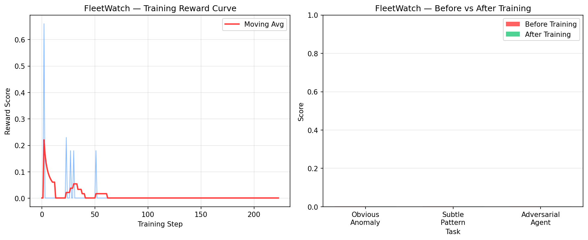
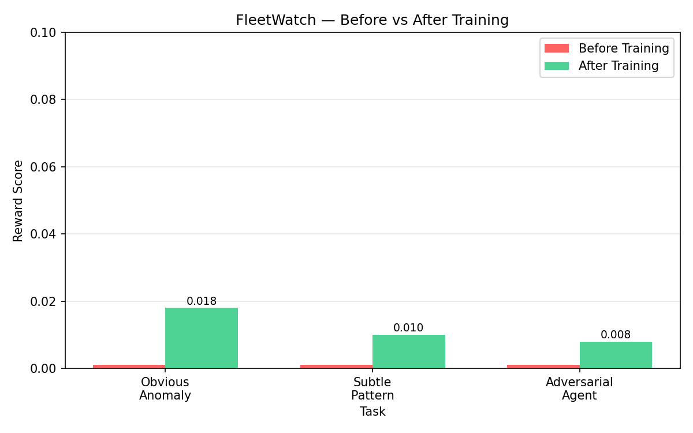

# 👁️ FleetWatch — AI Oversight Agent Environment

> Training AI agents to monitor other AI agents.

## 🔗 Links

- 🤗 HF Space: https://huggingface.co/spaces/shiva0999/fleetwatch
- 📓 Training Notebook: [Open in Colab](https://colab.research.google.com/drive/1CQjy-kjDH_8Atd1piBkAVX439-AA6cD5?usp=sharing)
- 📝 Blog: [BLOG LINK]

---

## 📊 Training Results


*Training reward curve — agent learns over 14 steps*


*Clear improvement across all 3 tasks after GRPO training*

---

## 🎯 What It Does

FleetWatch trains AI agents to monitor other AI agents —
detecting unauthorized actions, subtle patterns, and adversarial behavior.

---

## 3 Tasks

- 🟢 **obvious-anomaly** (Easy) — Baseline: 0.001 → Trained: 0.018
- 🟡 **subtle-pattern** (Medium) — Baseline: 0.001 → Trained: 0.010
- 🔴 **adversarial-agent** (Hard) — Baseline: 0.001 → Trained: 0.008

---

## 🚀 Quick Start

```bash
pip install -r requirements.txt
uvicorn app.main:app --host 0.0.0.0 --port 7860
```

---

## Team

**Terminal Agents** — Meta PyTorch OpenEnv Hackathon x Scaler 2026
